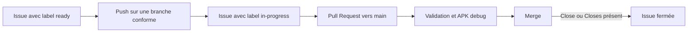

# RepTimer

[](https://github.com/YannickLevadoux/rep_timer/actions/workflows/ci.yml)
[](https://github.com/YannickLevadoux/rep_timer/actions/workflows/release.yml)

Application mobile (Android) de suivi et d'exécution de séances d'entraînement, développée avec Flutter.

Pas de version iOS prévue.

RepTimer permet de créer ses propres séances (échauffement, circuits, séries...), de les organiser en groupes d'exercices répétables, puis de les exécuter avec un système de minuteur, de progression et d'historique.

## Fonctionnalités

### Création et édition des séances
- Séances composées de **groupes d'exercices**, chaque groupe pouvant être répété un nombre de fois défini (rounds).
- Trois types d'exercices :
  - **Répétitions** — un nombre de répétitions à effectuer.
  - **Temps** — une durée définie (saisie via un sélecteur Minutes/Secondes).
  - **Durée libre** — aucun temps ni répétitions fixés à l'avance ; l'utilisateur décide lui-même de la fin de l'exercice, un chronomètre mesure le temps réellement passé.
- Pauses chronométrées entre les exercices.
- Réorganisation par glisser-déposer des groupes et des exercices.
- Aperçu repliable du contenu de chaque groupe et écran dédié à l'édition de ses paramètres, exercices et pauses.
- Option permettant de désactiver le préremplissage du nom des nouveaux exercices avec le nom du groupe.
- Duplication d'une séance depuis l'écran d'accueil, avec choix du nom de la copie ; la nouvelle séance reste indépendante de l'originale.
- Icône personnalisable par exercice, parmi une liste prédéfinie.
- Commentaire libre et optionnel par exercice (poids, intensité...), modifiable aussi bien à l'édition que pendant l'exécution de la séance.
- Détection des modifications non enregistrées à la fermeture de l'écran d'édition (proposition d'enregistrer, d'abandonner ou d'annuler).

### Exécution d'une séance
- Écran de résumé avant le lancement (aperçu des groupes et exercices).
- Empêche la mise en veille de l'écran pendant toute la durée de la séance.
- Chronomètre global de la séance, indépendant du minuteur de chaque exercice.
- Écran organisé autour des commandes de séance, de la progression, du prochain élément et de l'exercice ou de la pause en cours.
- Navigation manuelle entre les exercices (précédent/suivant), en plus de la progression automatique.
- Mise en évidence visuelle (clignotement) de l'exercice en cours.
- Pause/reprise de la séance à tout moment.
- Écran de progression détaillée, avec possibilité de sauter directement à un exercice donné (avec confirmation).
- Fin de séance anticipée ou normale, toutes deux enregistrées dans l'historique : le statut (`Terminée` / `Incomplète`) est toujours déterminé à partir de la progression réelle (mêmes coches que l'écran de progression détaillée), quel que soit le mode de fin de séance.
- Si l'ordre d'exécution est modifié manuellement (exercices/pauses sautés, groupes réalisés dans un autre ordre) et que le dernier exercice du dernier groupe est terminé alors que des éléments restent non réalisés, la séance ne se termine pas automatiquement : elle se met en pause et propose de **reprendre à un exercice de son choix** (via l'écran de progression) ou de **terminer la séance** (enregistrée avec le statut `Incomplète`).
- Si une pause est définie à la fin de la séance (dernière pause du dernier groupe), cette pause sera ignorée.
- Alerte de fin des exercices et pauses chronométrés, configurable sur **Son**, **Vibration** ou **Rien** depuis les paramètres et ajustable pendant la séance.
- Notification Android persistante pendant qu'un chronomètre est actif (pause, exercice Temps ou Durée libre — jamais pour un exercice Répétitions) : icône Play/Pause dans la barre d'état, nom de l'exercice/de la pause et temps restant (ou écoulé en Durée libre), prochain élément de la séance et bouton **Pause** / **Reprendre**. Un appui sur la notification rouvre la séance. Repose sur un vrai Foreground Service Android (et non une simple notification), afin que la mise à jour du chronomètre ainsi que le son/la vibration de fin d'exercice restent fiables même lorsque l'application est en arrière-plan. Disparaît automatiquement à la fin, à l'abandon, ou à l'arrêt de la séance.

### Quick Tabata
- Lancement rapide d'une séance travail/pause répétée, sans avoir à créer de séance au préalable (accessible depuis la barre de navigation de l'accueil).
- Nom, durée de travail, durée de pause et nombre de répétitions personnalisables ; temps total estimé recalculé en direct.
- La séance est générée entièrement en mémoire et exécutée avec le même moteur qu'une séance classique (mêmes statistiques, même historique) — elle n'est jamais ajoutée à la liste des séances enregistrées.

### Historique
- Historique local des séances effectuées : nom, date, durée totale, statut.
- Suppression d'une entrée d'historique avec confirmation.
- Détail d'une séance : temps passé sur chaque exercice

### Import / Export
- Export des séances enregistrées 
- Import des séances basé (json) sur un fichier précédement enregistré

### Interface
- Thème clair/sombre (suit le système, réglable manuellement).
- Interface entièrement en français.
- Interface uniquement en mode portrait pour conserver la lisibilité des écrans

## Stack technique

- **Flutter / Dart**
- Stockage local via `shared_preferences` (séances et historique, format JSON)
- `wakelock_plus` pour le maintien de l'écran actif pendant l'exécution
- `file_picker` pour l'import des séances
- `share_plus` pour l'export des séance via la fenetre stardard de partage d'éléments
- `flutter_launcher_icons` pour la gestion du logo
- `package_info_plus` pour l'affichage d'information du package (boite About ou A Propos)
- `flutter_foreground_task` pour le Foreground Service Android de la notification persistante pendant l'exécution d'une séance

Aucun backend, aucun compte utilisateur : toutes les données restent sur l'appareil.

## Prérequis

- [Flutter SDK](https://docs.flutter.dev/get-started/install) (canal stable)
- Un appareil Android (ou un émulateur) avec le débogage USB activé, ou le support desktop Linux activé (instable) pour tester sur PC

## Installation

```bash
git clone https://github.com/YannickLevadoux/rep_timer.git
cd rep_timer
flutter pub get
```

## Lancer l'application

Sur un appareil Android connecté :
```bash
flutter run
```

Sur Linux desktop :
```bash
flutter run -d linux
```

## Build

APK release :
```bash
flutter build apk --release
```
L'APK généré se trouve dans `build/app/outputs/flutter-apk/app-release.apk`.

## Structure du projet

```
lib/
├── main.dart                  # Écran d'accueil, liste des séances
├── models/                    # Training, ExerciseGroup, TrainingItem, historique...
├── screens/                   # Édition, résumé, exécution, progression, historique
├── services/                  # Stockage local (séances, historique)
├── widgets/                   # Composants réutilisables (cartes, pickers, sélecteurs)
└── utils/                     # Formatage, registre d'icônes...
```


## Développement GitHub & CI/CD

### Vue d'ensemble



Les automatisations sont réparties entre quatre workflows :

- `issue-lifecycle.yml` gère la convention des branches, les labels et la liaison entre les Pull Requests et les issues ;
- `flutter-validate.yml` centralise les contrôles Flutter réutilisés par la CI et les releases ;
- `ci.yml` valide les Pull Requests vers `main` et construit un APK debug ;
- `release.yml` construit et publie un APK signé lors de l'envoi d'un tag `v*`.

### Convention de nommage des branches

Chaque branche de développement doit être associée à une unique issue GitHub et respecter le format suivant :

```text
<type>/<issue>-<description>
```

avec :

- `type` parmi `feature`, `bugfix`, `hotfix` ou `clean` ;
- `issue` correspondant au numéro de l'issue GitHub ;
- `description` sous la forme d'une description courte, généralement en *kebab-case*.

Exemples :

```text
feature/33-refacto-training-editor
bugfix/61-session-save
hotfix/85-crash-startup
clean/76-refacto-whatever
```

Le workflow de cycle de vie surveille les pushes sur ces quatre familles de branches. Il vérifie leur nom avec l'expression `<type>/<numéro>-<description>` et échoue si le numéro d'issue ne peut pas être extrait. La même convention est contrôlée lors de l'ouverture et de la fusion d'une Pull Request, ainsi que lors de la suppression d'une branche.

### Cycle de vie d'une issue

Une issue prête à être développée doit d'abord porter le label `ready`.

Lors d'un push sur une branche conforme :

- le numéro de l'issue est extrait du nom de la branche ;
- le label `ready` est supprimé ;
- le label `in-progress` est ajouté.

L'opération est idempotente si l'issue porte déjà le label `in-progress`. En revanche, le workflow échoue si l'issue ne possède ni `ready` ni `in-progress`.

À l'ouverture d'une Pull Request, le workflow ajoute automatiquement la directive suivante au début de sa description si elle n'est pas déjà présente :

```text
Closes #<issue>
```

Lors de la fusion de la Pull Request :

- le label `in-progress` est retiré ;
- l'issue est fermée si la description ou un commentaire de la Pull Request contient `Close #<issue>` ou `Closes #<issue>`, sans distinction de casse.

Lorsqu'une branche est supprimée, le label `in-progress` est retiré si l'issue associée est encore ouverte. Les actions du workflow sont également publiées sous forme d'annotations et de tableaux récapitulatifs dans GitHub Actions.

### Validation des Pull Requests

Le workflow `ci.yml` s'exécute uniquement pour les Pull Requests ciblant `main`. Il appelle d'abord le workflow réutilisable `flutter-validate.yml`, qui effectue :

1. la récupération des dépendances avec `flutter pub get` ;
2. la vérification du formatage avec `dart format --output=none --set-exit-if-changed .` ;
3. l'analyse statique avec `flutter analyze --no-fatal-infos` ;
4. les tests automatisés avec `flutter test --coverage`.

Les informations remontées par l'analyseur ne sont donc pas bloquantes actuellement, contrairement aux avertissements et aux erreurs.

Une fois la validation réussie, un second job configure Java et Flutter, récupère les dépendances puis construit un APK Android debug avec :

```bash
flutter build apk --debug
```

Le build debug ne démarre pas si le job de validation échoue.

### Reproductibilité

Les jobs Flutter utilisent les mêmes versions et paramètres :

- Flutter `3.44.8`, explicitement épinglé avec le cache activé ;
- Java `17`, distribution Temurin ;
- versions épinglées des GitHub Actions utilisées par les workflows ;
- fichier `pubspec.lock` suivi dans le dépôt.

Les workflows CI et Release utilisent aussi des groupes de concurrence distincts. Lorsqu'une nouvelle exécution démarre pour une même référence Git, l'exécution précédente encore en cours est annulée.

### Création d'une release

Le workflow `release.yml` se déclenche lors de l'envoi de tout tag correspondant à `v*`. Il réutilise les mêmes validations que la CI avant d'autoriser le job de publication.

Après validation, le workflow :

1. configure Java 17 et Flutter 3.44.4 ;
2. récupère les dépendances ;
3. décode le keystore Android depuis le secret `KEYSTORE_BASE64` ;
4. génère `android/key.properties` à partir des secrets `KEYSTORE_PASSWORD`, `KEY_PASSWORD` et de la variable `KEY_ALIAS` ;
5. construit l'APK release signé avec `flutter build apk --release` ;
6. renomme l'artefact en `RepTimer-<tag>.apk` ;
7. crée une GitHub Release avec des notes générées automatiquement et y joint l'APK.

La publication nécessite donc que les validations réussissent et que les secrets et variables de signature Android soient configurés dans le dépôt GitHub.

### Mise à jour des dépendances

Renovate crée des Pull Requests portant le label `dependencies` pour :

- les dépendances Dart et Flutter, regroupées sous `Dart & Flutter packages` ;
- les GitHub Actions, regroupées sous `GitHub Actions` ;
- la version de Flutter déclarée dans les workflows, détectée par une règle dédiée.

Les Pull Requests Renovate ciblant `main` passent par les mêmes validations et le même build APK debug que les autres Pull Requests.


## About

Declarer l'image en tant que assets dans pubspec.yaml

```yaml
flutter:
  assets:
    - assets/icon/app_icon.png
```

Documentation — où modifier chaque information

| Information | Où c'est défini | Comment ça arrive dans le dialogue |
| ----------- | --------------- | ---------------------------------- |
| Nom de l'app | `android/app/src/main/AndroidManifest.xml`, attribut `android:label` | Lu au runtime par PackageInfo.fromPlatform().appName | 
| Icône | `assets/icon/app_icon.png` (le fichier source utilisé par flutter_launcher_icons pour générer les icônes natives) | Chargée via Image.asset(), une fois déclarée dans pubspec.yaml | 
| Version | `pubspec.yaml`, champ `version`: X.Y.Z+B | Lue via PackageInfo.fromPlatform().version/.buildNumber — c'est ce même champ que Flutter utilise pour générer versionName/versionCode Android à la compilation| 
| Copyright | Constante _copyright en haut de settings_screen.dart | Aucun autre endroit du projet ne porte cette info : c'est le seul point à éditer | 

## Auteur

[Yannick Levadoux](https://github.com/YannickLevadoux)

Avec l'aimable contribution de [Claude](https://claude.ai/)
