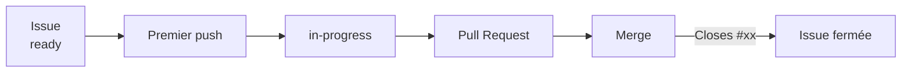

# RepTimer

Application mobile (Android) de suivi et d'exécution de séances d'entraînement, développée avec Flutter.

RepTimer permet de créer ses propres séances (échauffement, circuits, séries...), de les organiser en groupes d'exercices répétables, puis de les exécuter avec un système de minuteur, de progression et d'historique.

## Fonctionnalités

### Création et édition des séances
- Séances composées de **groupes d'exercices**, chaque groupe pouvant être répété un nombre de fois défini (rounds).
- Trois types d'exercices :
  - **Répétitions** — un nombre de répétitions à effectuer.
  - **Temps** — une durée définie (saisie via un sélecteur Minutes/Secondes).
  - **Durée libre** — aucun temps ni répétitions fixés à l'avance ; l'utilisateur décide lui-même de la fin de l'exercice, un chronomètre mesure le temps réellement passé.
- Pauses chronométrées entre les exercices.
- Réorganisation par glisser-déposer des groupes et des exercices.
- Icône personnalisable par exercice, parmi une liste prédéfinie.
- Commentaire libre et optionnel par exercice (poids, intensité...), modifiable aussi bien à l'édition que pendant l'exécution de la séance.
- Détection des modifications non enregistrées à la fermeture de l'écran d'édition (proposition d'enregistrer, d'abandonner ou d'annuler).

### Exécution d'une séance
- Écran de résumé avant le lancement (aperçu des groupes et exercices).
- Empêche la mise en veille de l'écran pendant toute la durée de la séance.
- Chronomètre global de la séance, indépendant du minuteur de chaque exercice.
- Navigation manuelle entre les exercices (précédent/suivant), en plus de la progression automatique.
- Mise en évidence visuelle (clignotement) de l'exercice en cours.
- Pause/reprise de la séance à tout moment.
- Écran de progression détaillée, avec possibilité de sauter directement à un exercice donné (avec confirmation).
- Fin de séance anticipée ou normale, toutes deux enregistrées dans l'historique : le statut (`Terminée` / `Incomplète`) est toujours déterminé à partir de la progression réelle (mêmes coches que l'écran de progression détaillée), quel que soit le mode de fin de séance.
- Si l'ordre d'exécution est modifié manuellement (exercices/pauses sautés, groupes réalisés dans un autre ordre) et que le dernier exercice du dernier groupe est terminé alors que des éléments restent non réalisés, la séance ne se termine pas automatiquement : elle se met en pause et propose de **reprendre à un exercice de son choix** (via l'écran de progression) ou de **terminer la séance** (enregistrée avec le statut `Incomplète`).
- Si une pause est définie la fin de la séance (dernière pause du dernier groupe), cette pause sera ignorée.
- Notification Android persistante pendant qu'un chronomètre est actif (pause, exercice Temps ou Durée libre — jamais pour un exercice Répétitions) : icône Play/Pause dans la barre d'état, nom de l'exercice/de la pause et temps restant (ou écoulé en Durée libre) dans la notification repliée, prochain élément de la séance et boutons **Pause** / **Voir la séance** une fois développée. Repose sur un vrai Foreground Service Android (et non une simple notification), afin que la mise à jour du chronomètre ainsi que le son/la vibration de fin d'exercice restent fiables même lorsque l'application est en arrière-plan. Disparaît automatiquement à la fin, à l'abandon, ou à l'arrêt de la séance.

### Quick Tabata
- Lancement rapide d'une séance travail/pause répétée, sans avoir à créer de séance au préalable (accessible depuis la barre de navigation de l'accueil).
- Nom, durée de travail, durée de pause et nombre de répétitions personnalisables ; temps total estimé recalculé en direct.
- La séance est générée entièrement en mémoire et exécutée avec le même moteur qu'une séance classique (mêmes statistiques, même historique) — elle n'est jamais ajoutée à la liste des séances enregistrées.

### Historique
- Historique local des séances effectuées : nom, date, durée totale, statut.
- Suppression d'une entrée d'historique avec confirmation.
- Détail d'une séance : temps passé sur chaque exercice

### Import / Export
- Export des séances enregistrées 
- Import des séances basé (json) sur un fichier précédement enregistré

### Interface
- Thème clair/sombre (suit le système, réglable manuellement).
- Interface entièrement en français.
- Interface uniquement en mode portrait pour conserver la lisibilité des écrans

## Stack technique

- **Flutter / Dart**
- Stockage local via `shared_preferences` (séances et historique, format JSON)
- `wakelock_plus` pour le maintien de l'écran actif pendant l'exécution
- `file_picker` pour l'import des séances
- `share_plus` pour l'export des séance via la fenetre stardard de partage d'éléments
- `flutter_launcher_icons` pour la gestion du logo
- `package_info_plus` pour l'affichage d'information du package (boite About ou A Propos)
- `flutter_foreground_task` pour le Foreground Service Android de la notification persistante pendant l'exécution d'une séance

Aucun backend, aucun compte utilisateur : toutes les données restent sur l'appareil.

## Prérequis

- [Flutter SDK](https://docs.flutter.dev/get-started/install) (canal stable)
- Un appareil Android (ou un émulateur) avec le débogage USB activé, ou le support desktop Linux activé pour tester sur PC

## Installation

```bash
git clone https://github.com/YannickLevadoux/rep_timer.git
cd rep_timer
flutter pub get
```

## Lancer l'application

Sur un appareil Android connecté :
```bash
flutter run
```

Sur Linux desktop :
```bash
flutter run -d linux
```

## Build

APK release :
```bash
flutter build apk --release
```
L'APK généré se trouve dans `build/app/outputs/flutter-apk/app-release.apk`.

## Structure du projet

```
lib/
├── main.dart                  # Écran d'accueil, liste des séances
├── models/                    # Training, ExerciseGroup, TrainingItem, historique...
├── screens/                   # Édition, résumé, exécution, progression, historique
├── services/                  # Stockage local (séances, historique)
├── widgets/                   # Composants réutilisables (cartes, pickers, sélecteurs)
└── utils/                     # Formatage, registre d'icônes...
```


## Développement GitHub

### Overview




### Convention de nommage des branches

Chaque branche de développement doit être associée à **une unique issue GitHub**.

Le nom de la branche doit respecter le format suivant :

```text
<type>/<issue>-<description>
```

avec :

* `type` ∈ `feature`, `bugfix`, `hotfix`, `clean`
* `issue` = numéro de l'issue GitHub
* `description` = description courte en *kebab-case*

Exemples :

```text
feature/33-refacto-training-editor
feature/84-rendre-ci-reproductible

bugfix/61-session-save

hotfix/85-crash-startup

clean/76-refacto-whatever
```

Toute autre convention de nommage est refusée par la CI.

---

## Cycle de vie d'une issue

Le dépôt automatise la gestion des labels GitHub en fonction du cycle de développement.

### 1. Avant le développement

Une issue prête à être développée doit posséder le label :

```text
ready
```

---

### 2. Premier push d'une branche

Lors du premier push d'une branche respectant la convention ci-dessus, la CI :

* extrait automatiquement le numéro d'issue depuis le nom de la branche ;
* vérifie que l'issue possède le label `ready`.

Si c'est le cas :

* le label `ready` est supprimé ;
* le label `in-progress` est ajouté.

Cette opération est idempotente.

Si l'issue ne possède ni `ready` ni `in-progress`, le workflow échoue afin de signaler un état incohérent.

---

### 3. Ouverture d'une Pull Request

À l'ouverture d'une Pull Request, la description est automatiquement complétée avec :

```text
Related to #<issue>
```

Exemple :

```text
Related to #33
```

Cette liaison permet de retrouver facilement l'issue associée.

Si la Pull Request résout complètement l'issue, remplacer ensuite cette ligne par :

```text
Closes #33
```

GitHub fermera alors automatiquement l'issue lors du merge.

---

### 4. Fusion de la Pull Request

Lorsqu'une Pull Request est fusionnée :

* le label `in-progress` est supprimé ;
* si la description contient `Closes #<issue>`, GitHub ferme automatiquement l'issue.

---

### 5. Suppression d'une branche

Lorsqu'une branche de développement est supprimée :

* si l'issue est toujours ouverte ;
* le label `in-progress` est automatiquement retiré.

Cela évite de laisser des issues bloquées dans un état "en cours" alors que la branche n'existe plus.

---

## CI/CD

Les workflows GitHub Actions utilisent une configuration reproductible.

### Flutter

La version de Flutter est épinglée :

```text
Flutter 3.44.4
```

Les builds n'utilisent jamais simplement le canal `stable`.

---

### Vérifications exécutées

Chaque Pull Request et chaque Release exécutent les contrôles suivants :

1. récupération des dépendances (`flutter pub get`)
2. vérification du formatage (`dart format`)
3. analyse statique (`flutter analyze`)
4. exécution des tests (`flutter test`)

Une release n'est publiée que si l'ensemble de ces étapes réussit.

---

### Mise à jour des dépendances

Le dépôt utilise Renovate afin de proposer automatiquement des Pull Requests pour :

* les dépendances Dart / Flutter (`pub`);
* les GitHub Actions ;
* la version de Flutter utilisée par les workflows.

Toutes les mises à jour passent par la CI avant d'être fusionnées.


## About

Declarer l'image en tant que assets dans pubspec.yaml

```yaml
flutter:
  assets:
    - assets/icon/app_icon.png
```

Documentation — où modifier chaque information

| Information | Où c'est défini | Comment ça arrive dans le dialogue |
| ----------- | --------------- | ---------------------------------- |
| Nom de l'app | `android/app/src/main/AndroidManifest.xml`, attribut `android:label` | Lu au runtime par PackageInfo.fromPlatform().appName | 
| Icône | `assets/icon/app_icon.png` (le fichier source utilisé par flutter_launcher_icons pour générer les icônes natives) | Chargée via Image.asset(), une fois déclarée dans pubspec.yaml | 
| Version | `pubspec.yaml`, champ `version`: X.Y.Z+B | Lue via PackageInfo.fromPlatform().version/.buildNumber — c'est ce même champ que Flutter utilise pour générer versionName/versionCode Android à la compilation| 
| Copyright | Constante _copyright en haut de settings_screen.dart | Aucun autre endroit du projet ne porte cette info : c'est le seul point à éditer | 

## Auteur

[Yannick Levadoux](https://github.com/YannickLevadoux)

Avec l'aimable contribution de [Claude](https://claude.ai/)