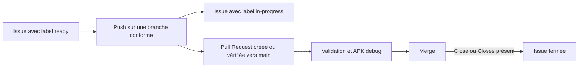

# Intégration continue et déploiement

Cette documentation décrit les workflows GitHub Actions de RepTimer. Les
conventions appliquées aux branches et aux issues sont décrites dans le
[guide de contribution](../CONTRIBUTING.md).

## Vue d'ensemble



Les automatisations sont réparties entre quatre workflows :

- `issue-lifecycle.yml` gère les labels, la création des Pull Requests et leur
  liaison avec les issues ;
- `flutter-validate.yml` centralise les contrôles Flutter réutilisés par la CI
  et les releases ;
- `ci.yml` valide les Pull Requests vers `main` et construit un APK debug ;
- `release.yml` construit et publie un APK signé lors de l'envoi d'un tag
  `v*`. Sa procédure est détaillée dans le guide des
  [builds et releases](release.md#publication-dune-release).

## Authentification de la création des Pull Requests

L'étape `Sync issue and pull request` utilise un PAT fine-grained stocké dans
le secret GitHub Actions `PR_AUTOMATION_TOKEN`. L'utilisation de ce PAT, plutôt
que de `GITHUB_TOKEN`, permet aux validations de la Pull Request créée
automatiquement de démarrer sans approbation manuelle du workflow.

Le PAT doit être limité à ce dépôt et disposer uniquement des permissions
suivantes :

- `Issues` : `Read and write` ;
- `Pull requests` : `Read and write`.

Les jobs de fusion et de suppression continuent d'utiliser `GITHUB_TOKEN`. Le
PAT ne doit jamais être ajouté directement au dépôt. Lors de son
renouvellement, seule la valeur du secret `PR_AUTOMATION_TOKEN` doit être mise à
jour dans `Settings` → `Secrets and variables` → `Actions`.

## Validation des Pull Requests

Le workflow `ci.yml` s'exécute uniquement pour les Pull Requests ciblant
`main`. Il appelle d'abord le workflow réutilisable `flutter-validate.yml`.

Après le checkout, un rapport recense les fichiers Dart suivis par Git sous
`lib/`. Il affiche dans le résumé de l'Action trois tableaux triés par nombre de
lignes :

- plus de 300 lignes ;
- entre 250 et 300 lignes ;
- entre 200 et 249 lignes.

Le comptage comprend les commentaires et les lignes vides. Les fichiers de
tests et les fichiers générés ne sont pas inclus. Chaque fichier doit avoir au
plus **199 lignes physiques** ; un fichier de 200 lignes fait échouer la
validation.

Le workflow poursuit ensuite les contrôles Flutter :

1. récupération des dépendances avec `flutter pub get` ;
2. vérification du formatage avec
   `dart format --output=none --set-exit-if-changed .` ;
3. analyse statique avec `flutter analyze --no-fatal-infos` ;
4. tests automatisés avec `flutter test --coverage`.

Les informations remontées par l'analyseur ne sont pas bloquantes actuellement,
contrairement aux avertissements et aux erreurs.

### Couverture des tests

Après `flutter test --coverage`, le script
`.github/scripts/coverage_report.dart` vérifie que `coverage/lcov.info` existe,
n'est pas vide et contient des lignes Dart instrumentables sous `lib/`. Une
entrée absente ou invalide fait échouer la validation avec un diagnostic
explicite.

Le résumé GitHub Actions présente :

- les lignes couvertes, les lignes instrumentables et le pourcentage global ;
- la couverture des domaines `models`, `services`, `controllers`, `screens`,
  `widgets`, `validation`, `utils` et de la racine de `lib` ;
- les fichiers à 0 % et ceux sous 80 % ;
- dans une Pull Request, la couverture des lignes Dart ajoutées ou modifiées.

La couverture globale est bloquante sous **91,78 %**. La couverture des lignes
ajoutées ou modifiées est bloquante sous **90,00 %** lorsqu'elle est
calculable. Elle affiche `N/A` sans faire échouer ce second contrôle lorsque le
contexte de Pull Request est indisponible ou qu'aucune ligne instrumentable n'a
changé. Le LCOV absent ou invalide reste toujours bloquant.

La baseline finale de la version 1.3.2, mesurée sur le commit `3f8820e`, est de
**91,78 %** (`5 079 / 5 534` lignes) avec 422 tests réussis. Cette valeur reste
un indicateur de couverture de lignes : elle ne remplace pas les validations
des comportements natifs Android.

Le fichier `coverage/lcov.info` est publié dans l'artefact
`test-coverage-lcov` pendant 14 jours. Aucun service de couverture externe,
commentaire automatique de Pull Request ou permission d'écriture
supplémentaire n'est nécessaire.

### Modifier les seuils qualité

Les deux seuils de couverture sont définis au début de
`.github/scripts/coverage_report.dart` :

- `coverageThreshold` contrôle la couverture globale ;
- `changedCoverageThreshold` contrôle les lignes ajoutées ou modifiées.

Les valeurs sont des pourcentages et le verdict utilise, comme le résumé
GitHub Actions, une précision de deux décimales. Après une modification, mettre
à jour les cas de borne et les libellés attendus dans
`test/tool/coverage_report_test.dart`, ainsi que la valeur documentée ci-dessus.
Si le nouveau seuil global dépasse la couverture de la fixture
`.github/scripts/fixtures/coverage/above-threshold.info`, adapter également
cette fixture. Puis exécuter :

```bash
flutter test test/tool/coverage_report_test.dart
flutter test --coverage
dart .github/scripts/coverage_report.dart coverage/lcov.info
```

La limite de taille est utilisée à deux endroits parce que le contrôle CI et
le contrôle précédant les builds locaux n'emploient pas le même langage :

- le paramètre `maximumLines` de `writeFileLengthSummary` dans
  `.github/scripts/workflow-utils.js` ;
- la comparaison et son diagnostic dans
  `tool/flutter_with_build_metadata.sh`.

Ces deux valeurs doivent rester identiques. Adapter simultanément les bornes
dans `test/tool/flutter_with_build_metadata_test.dart`, qui vérifie notamment
que la valeur limite passe et que la ligne suivante bloque le build.
Enfin, exécuter :

```bash
flutter test test/tool/flutter_with_build_metadata_test.dart
dart format --output=none --set-exit-if-changed .
flutter analyze --no-fatal-infos
```

Une fois la validation réussie, un second job configure Java et Flutter,
récupère les dépendances puis construit un APK Android debug avec :

```bash
flutter build apk --debug
```

Le build debug ne démarre pas si le job de validation échoue.

## Reproductibilité

Les jobs Flutter utilisent les mêmes versions et paramètres :

- Flutter `3.44.9`, explicitement épinglé avec le cache activé ;
- Java `17`, distribution Temurin ;
- versions épinglées des GitHub Actions utilisées par les workflows ;
- fichier `pubspec.lock` suivi dans le dépôt.

Les workflows CI et Release utilisent des groupes de concurrence distincts.
Lorsqu'une nouvelle exécution démarre pour une même référence Git, l'exécution
précédente encore en cours est annulée.
